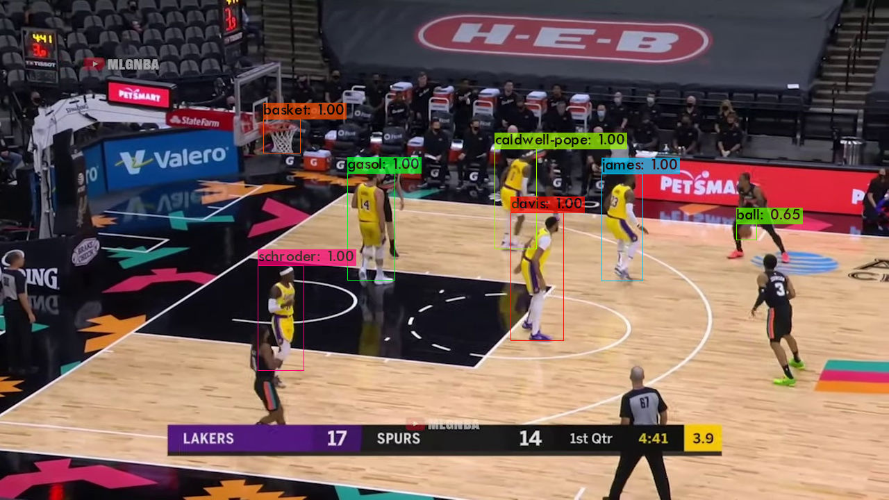
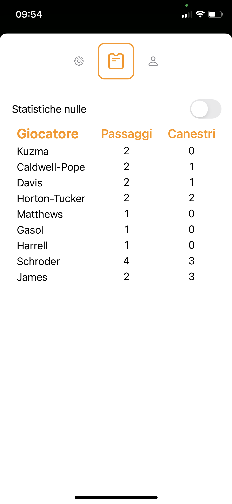
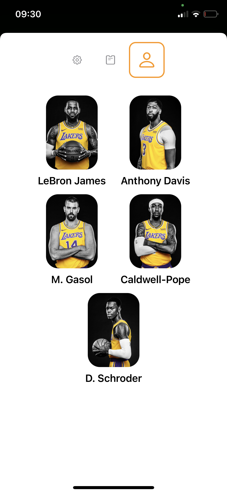

# LALakersAI
An iOS app that uses a CoreML model to take informations about Los Angeles Lakers' players.

## Author
[Daniele Colautti](https://github.com/danielecolautti)

## CoreML Model
The model used by the app is YOLOv3 trained using 2230 images (1775 train and 445 test) of Los Angeles Lakers' highlights.

## Citations
Model: [YOLOv3](https://pjreddie.com/darknet/yolo/)

Similar app used to develop this application: [YOLOv3-CoreML](https://github.com/Ma-Dan/YOLOv3-CoreML)

## Useful Google Colab file

[From YOLOv3 to Custom Object Detection](https://colab.research.google.com/drive/1BNajhZAxU_8J8DoK43y2JEJog0l4Hb6X)

## Before Building the App
Download the [model](https://github.com/danielecolautti/LALakersAI/tree/main/zippedModel) and copy it into LALakersAI/Utils/

## Example Images

### Model Output

### Live Detection

### Statistics

### Line Up

### Successful Shot by Anthony Davis

### Settings

