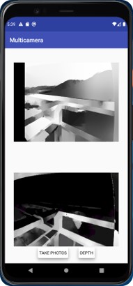

# MulticameraDepth
## Android application for calculating a depth image from two stereo images using OpenCV and neural network (TensorFlow Lite model)

## Authors
[Lucrezia Corsaro](https://github.com/LucreziaCorsaro), [Salvatore Lia](https://github.com/SalvatoreLia), [Mattia Pranzini](https://github.com/MattiaPranzini)

## Instructions for opening project
- Installing Android Studio
- Installing Python 3
- Installing OpenCV in Python with pip install opencv-python
- Open project with Android Studio

## Device requirements
The application was tested on the Huawei P30 Pro. The app uses camera 0 (standard) and 3 (wide angle) of the camera2 API.
The OS of the phone must allow access to individual cameras.

## App Instructions
We have developed a simple app that uses OpenCV and a neural network to calculate the depth from two images. The app must be used in landscape mode during capturing photos. First of all the app needs a calibration. To calibrate please print the file chessboard.png (in A4 format) and attach to a rigid support. The app will automatically request the acquisition of a series of photos of the chessboard and will proceed to the calibration.
The photos must be taken in different positions, making sure that all the squares of the chessboard are seen in each photo. The use of a tripod is recommended during this phase.
After calibration you will be able to use the app normally. At the top the processing with OpenCV will be shown, at the bottom the one with the neural network.
The images will be saved in the storage/MulticameraDepth folder.

## Screenshot
