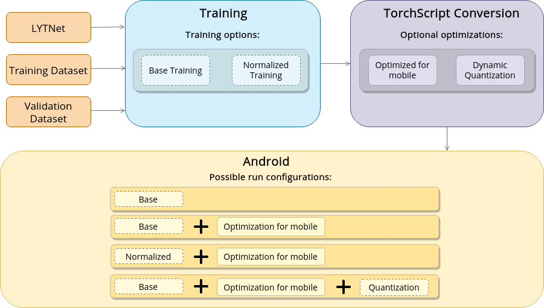

# eyeDo
## an Android Application for the Visually Impaired that use LytNet Neural Network to recognize Pedestrian Traffic Light

The dataset and model we used for our project is based on the ones used for the project "ImVisible", explained at this link: https://arxiv.org/abs/1907.09706.

## Author

[Luca Foianesi](https://github.com/Luc-dotcom) [Gori Giacomo](https://github.com/beawareoftheg) [Marco Morozzi](https://github.com/marcoleino)

## Introduction
In this project we trained a model called LytNet, then we converted the model from Pytorch to TorchScript and developed an Android App that uses it to recognize the state of pedestrian traffic lights. The following image represents the approach we followed and the related path options.

To train and test the LytNet we have used "Pedestrian-Traffic-Lights (PTL)", which is a high-quality image dataset of street intersections, created for this problem of image classification. Images have variations in weather, position and orientation in relation to the traffic light. To download the dataset you can visit the ImVisible project (link above).
# eyeDoPy

## Training

|   | Training | Validation | Testing | Total
|---|----------|------------|---------|-------
Number of Images | 3456 | 864 | 739 | 5059
Percentage | 68.3% | 17.1% | 14.6% | 100%

Use these stats for image normalization:  
mean = [120.56737612047593, 119.16664454573734, 113.84554638827127]  
std=[66.32028460114392, 65.09469952002551, 65.67726614496246]

### Labels

Classes are as follows:

0: Red
1: Green
2: Countdown Green
3: Countdown Blank
4: None

Here are the precisions of networks for each class:

|         | Red | Green | Countdown Green | Countdown Blank | None
|---------|-----|-------|-----------------|-----------------|--------|
Base Precision | 0.97 | 0.94 | 0.99 | 0.90 | 0.76
Base Opt Precision | 0.95 | 0.94 | 0.98 | 0.91 | 0.75
Base Opt Quantized Precision | 0.96 | 0.92 | 0.99 | 0.89 | 0.78
Normalized Precision | 0.92 | 0.96 | 0.97 | 0.91 | 0.45
Normalized Opt Precision | 0.93 | 0.91 | 0.94 | 0.91 | 0.50

Opt stands for Optimized for Mobile.

The network model is adapted from a MobileNetV2, with a larger input size of 768x576 designed for a image classification task that involves a smaller object within the image (such as a traffic light). 

## Conversion
The code that converts a Pytorch model to a TorchScript one is the file "fromPTtoPTScript.py". 

The network needs a [batch, channels, height, width] shape. See fromPTtoPTScript.py for more information about it.

# eyeDo_Android
## App

We have developed a simple app that uses the trained LytNet network to recognize the state of pedestrian traffic lights. The app can be used only in landscape mode. It is composed by a preview of the camera, a settings menu (to choose the type of net to use) and an image of a traffic light that will light differently respect to the recognized color (black if none) which can be clicked to see informations about the net and its performance.

The app changes state of the recognized color only if 4 consecutive net predictions are the same, to increase accuracy at the cost of a slight drop in performance. For each state, the app (a thread) emits a different sound:

 1. None: low tone with slow frequency
 2. Red: low tone with slightly higher frequency (1 per sec)
 3. Green: double mid tone with medium frequency
 4. Yellow: one high tone with high frequency (>1 per sec)
 
 ### API and Camera

The app uses API of Camera2 class for Android. The app selects a camera with a resolution higher than 768x576 and chooses a preferable ratio of 4:3: If 4:3 can't be found it chooses the highest resolution and add black pixels to the image to fit it for the correct ratio. In any case, the image will be resized during PreProcess to 768x576.

### Elaboration

The elaboration of images by the CNN is carried out for each new frame received only when the previous elaboration is finished (this is to avoid calling the elaboration function for every single frame). They are performed by the class Classifier, called by the MainActivity.

To see how we properly pre-process an image before sending it to the network in TorchScript, look at the PreProcess function inside of Classifier in the Android App, where we make our own transposing algorithm.

To use the application you can download the code and open it inside Android Studio.

## Instruction to load weights in Android Studio

The weights that the Android App uses are uploaded on another platform to save space. If you want to run the application from Android Studio you have to copy the weights following these instructions:

 1. Download the weights from <link_to_add>
 2. Open the folder TorchScript_weights
 3. Copy all the weights (files with .pt extension) into eyeDo_Android/app/src/main/assets/

Now you can compile and run the application. Enjoy!
