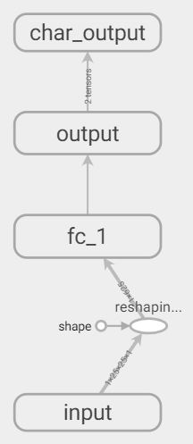
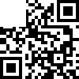
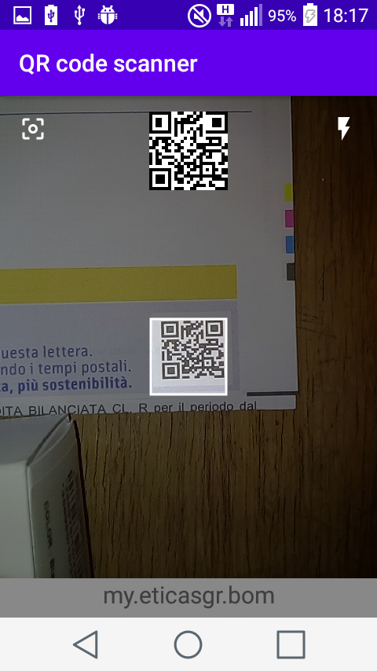

# QR code scanner
A simple Android application that decodes QR codes in the absence of one of the finder patterns.
15 neural networks are used to decode a maximum of 15 characters of the string encoded in the QR code.

Before run any python script install the python libraries indicated in python_train_and_test/list_of_required_python_lib.txt.

## Networks Architecture
each network is composed of:
1) 625 input neurons (input qr codes have 25x25 resolution)
2) a hidden layer with 128 neurons
3) 30 output neurons (1 neurons for each character that networks can predict)
4) a final layer that  find the output neuron with the highest value. The index of this neuron is inserted in the string "abcdefghijklmnopqrstuvwxyz./:#" to find the predicted character. The # is used when the string in the QR code is too short.

The training and validation dataset are generated using dataset_generator.py script; the test dataset is generated with the test_dataset_generator.py script.

The dataset images are similar to the following

If you want to use the maskWhite.dll to damage the QR you have to set the absolute path to it in the first lines of dataset_generator.py (variable mask_lib).
There is also a python implementation in the function applyDamageMaskPython. If you want to use this change the call applyDamageMaskDll to applyDamageMaskPython.

## Android application
The base application is [code-scanner](https://github.com/yuriy-budiyev/code-scanner). 

After being modified to host neural networks for decoding, the only window of the project is the following

The application continuously captures frames from the phone's camera and sends them to networks. 
The current input of the networks is visible in the upper square while the last successfully decoded string is shown at the bottom of the screen.
