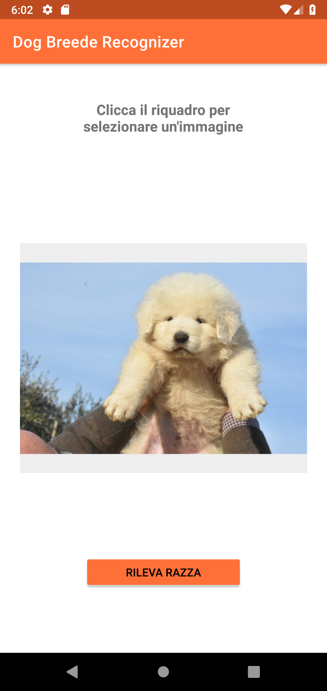
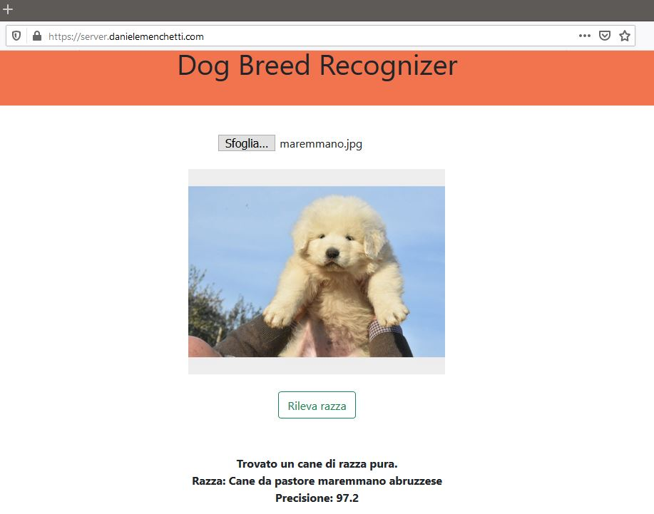

# DogBreedRecognizer
DogBreedRecognizer is a software used for dog breed recognition. 
Check the "report-presentation" folder for more info. 
Deployment as Android app and Raspberry client-server software.

## Author
[Daniele Menchetti](https://github.com/danielemenchetti)

## General info
1) Always check paths before run anything.
2) Links in report and presentation are down.

## Info about Raspberry server-side deployment
1) Raspberry must have TensorFlow 1.13+ installed.
2) Make "uploads" folder writable to all to store image from the client.

## Example Images

### Best model architecture (10 classes)

### Android app screenshots
 

### Raspberry client-side screenshots

