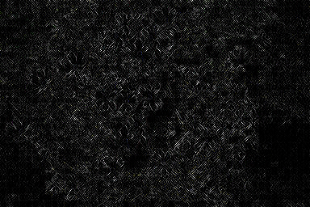

# Tampery App
Tampery is a software used to recognize tampered images. We use three different techniques to extract features from images to classify them as pristine or tampered.
We also deployed this software as an android application. 
 ## Authors
[Antonio Spina](https://github.com/antonio-sp) [Andrea Mengascini](https://github.com/andrea-mengascini) 
## Citations
Dataset: [Casia Dataset](https://res.mdpi.com/symmetry/symmetry-11-00083/article_deploy/symmetry-11-00083.pdf)

NoisePrint: [Noiseprint Model](https://grip-unina.github.io/noiseprint/)

SRM: [SRM Filter Kernel](https://openaccess.thecvf.com/content_cvpr_2018/papers/Zhou_Learning_Rich_Features_CVPR_2018_paper.pdf)

## Instructions

## Example Images
*RGB Image*
*NoisePrint Map*
*SRM Map*
## Android Application

### Screenshot

### Chaqopie